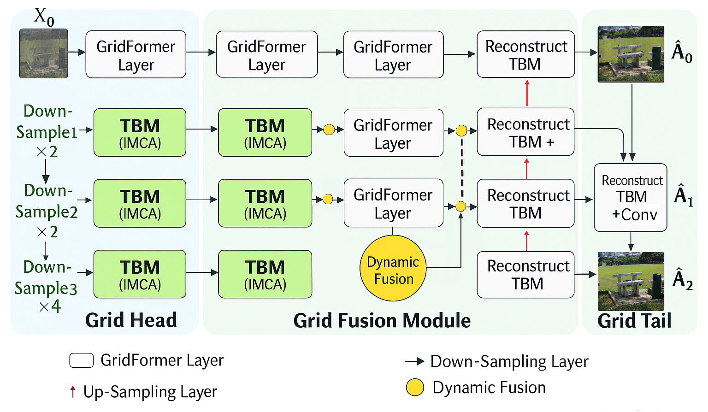

# GridFormer-TR: Multi-Scale Cross-Attention for Multi-Weather Restoration

GridFormer-TR is my customization of the original [GridFormer](https://github.com/TaoWangzj/GridFormer) backbone for restoring images captured under rain, snow, haze, or hybrid degradations. This fork keeps the grid-based residual dense transformer idea but introduces cross-scale attention, additional perceptual losses, and updated training utilities tailored to my mixed-weather experiments.

> **Original work:** Wang et al. "GridFormer: Residual Dense Transformer with Grid Structure for Image Restoration in Adverse Weather Conditions", IJCV 2024.  
> **This repo:** extends the published codebase with new attention blocks, loss modules, and training configs for the Turkish multi-weather dataset I curated (758 images).

---

## Highlights
- **Multi-scale cross-attention stack** (`InnovativeMultiScaleCrossAttention`) combines local self-attention, cross-scale attention, SE gates, and dynamic fusion with a learnable `cross_scale` factor.
- **Stabilized transformer blocks** add LayerScale residual modulation, DropPath-based stochastic depth, and optional checkpointing inside TBM/RDTB modules.
- **Expanded loss library** (DISTS, SSIM, MS-SSIM, HDR Charbonnier, Total Variation, Edge) with ready YAML hooks under `basicsr/losses/`.
- **Experiment-ready config** for multi-weather restoration: `options/train/GridFormer/Multi_weather_Restoration/GridFormer_mixed.yml`.
- **Integrated DISTS implementation** (PyTorch/TF/MATLAB) vendored under `DISTS/` to avoid extra submodules.

---

## Visual Overview

- Full pipeline with three-level grid head, dynamic fusion, and scale-wise reconstruction for GridFormer-TR.

---

## Architectural Differences vs. Original GridFormer
| Area | Original Repo | GridFormer-TR |
| --- | --- | --- |
| Attention core | Compact Self-Attention (CSA) with sampler/local stages | LocalAttention plus CrossAttention per scale, fused via `DynamicFusion` and SE blocks |
| Multi-scale context | Relying on grid routing only | Explicit `scales=(1,2,4)` branches with learnable `cross_scale` gain and bilinear alignment |
| Transformer block | LayerNorm -> CSA -> FFN with basic residuals | LayerNorm + (LayerScale * DropPath * multi-scale attn) + LayerNorm + (LayerScale * DropPath * FFN) |
| Dense modules | Fixed parameters, no stochastic depth | TBM/make_dense/RDTB accept `drop_path_prob`, `layer_scale_init_values`, `use_innovative_attn`, `scales`, `downsample_factor` |
| Extract/Reconstruct heads | OverlapPatchEmbed + TBM | 3x3 conv + TBM with the same cross-attention stack and checkpoint-aware forward pass |
| Losses | Charbonnier + perceptual | Adds DISTS, SSIM/MS-SSIM, TV, Edge, HDR Charbonnier; composite loss configurable from YAML |

See `basicsr/archs/GridFormer_arch.py` for the implementation details.

---

## Custom Experiment Setup (758 Mixed-Weather Images)
- **Dataset:** 758 aligned image pairs collected from my AllWeather-style experiments (rain, haze, and snow combinations).  
- **Training schedule:** 100 epochs, 6,400 iterations (identical batch size and patch sampling for both models).  
- **Config:** `options/train/GridFormer/Multi_weather_Restoration/GridFormer_mixed.yml` (AdamW, cosine learning rate, DISTS + SSIM + L1).  
- **Hardware:** 2 x RTX 4090 with AMP.  
- **Logging:** TensorBoard under `tb_logger/`, optional Weights & Biases runs under `wandb/` (ignored by Git).

### Results (same dataset and schedule)
| Model | Epochs | Iterations | PSNR (dB) | SSIM |
| --- | --- | --- | --- | --- |
| Original GridFormer (CSA attention) | 100 | 6,400 | 24.77 | 0.8549 |
| **GridFormer-TR (multi-scale cross-attn)** | 100 | 6,363 (best ckpt) | **24.9423** | 0.8540 |

- Training log excerpt (`2025-04-13 16:28:34`) shows `psnr: 24.9423` and `ssim: 0.8540` at iteration 6,363.  
- GridFormer-TR improves PSNR by +0.17 dB while keeping SSIM comparable (-0.0009), and produces sharper rain structures in qualitative comparisons.

---

## Getting Started
### Dependencies
```bash
conda create -n gridformer-tr python=3.11
conda activate gridformer-tr
pip install -r requirements.txt
python setup.py develop  # installs BasicSR ops locally
```

### Repository
```bash
git clone https://github.com/lutfiozark/GridFormer-TR.git
cd GridFormer-TR
```

### Dataset Preparation
1. Place paired training data under `datasets/Allweather/{train,val}/` (or update the YAML paths).  
2. Edit `options/train/GridFormer/Multi_weather_Restoration/GridFormer_mixed.yml` with absolute dataset paths.  
3. Optionally download the public benchmarks listed in the original paper if you plan to reproduce IJCV numbers.

### Training
```bash
./train.sh options/train/GridFormer/Multi_weather_Restoration/GridFormer_mixed.yml
```
- The script launches distributed training; adjust `train.sh` if you want a single GPU or different world size.

### Evaluation
```bash
python basicsr/test.py -opt options/train/GridFormer/Multi_weather_Restoration/GridFormer_mixed.yml \
                       --launcher none --save-result
```
- Switch `--launcher` to `pytorch` when evaluating in distributed mode.  
- Validation outputs are written to `results/GridFormer_mixed/val_images/`.

---

## Additional Components
- `DISTS/`: Vendored perceptual metric; `basicsr/losses/dists_loss.py` exposes `DISTSLoss`.  
- `pretrained/`: place downloaded checkpoints here (directory ignored by Git).  
- `experiments/`, `debug_outputs/`, `tb_logger/`, `wandb/`: runtime artifacts filtered via `.gitignore`.

---

## Citation and Acknowledgements
- Please cite the original IJCV paper if you use this repository:

```bibtex
@article{wang2024gridformer,
  title   = {GridFormer: Residual Dense Transformer with Grid Structure for Image Restoration in Adverse Weather Conditions},
  author  = {Wang, Tao and Zhang, Kaihao and Shao, Ziqin and Luo, Wenhan and Stenger, Bjorn and Lu, Tong and Kim, Tae-Kyun and Liu, Wei and Li, Hongdong},
  journal = {International Journal of Computer Vision},
  year    = {2024}
}
```

- GridFormer-TR builds on [BasicSR](https://github.com/XPixelGroup/BasicSR), [Restormer](https://github.com/swz30/Restormer), and the official GridFormer codebase.  
- For questions or collaboration requests, please open an issue on GitHub.

---

Made with love for multi-weather restoration research in Turkey.
